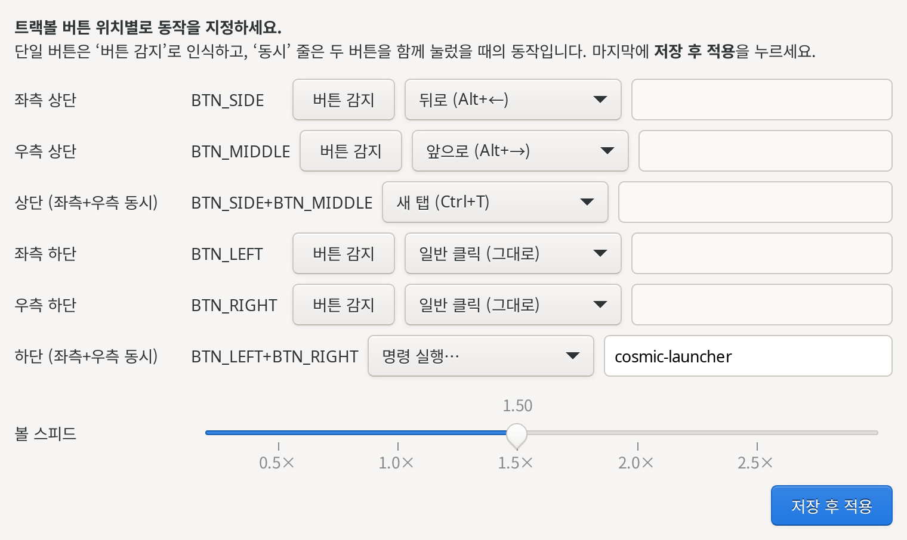

# ktrackball — Kensington trackball button mapper (Pop!_OS / Wayland)

A lightweight `evdev`/`uinput` daemon that remaps the buttons of a Kensington
trackball to actions — browser **Back/Forward**, key combos, commands, ball-scroll,
or a precision mode. It works at the kernel level, so it runs under **Wayland**
(Pop!_OS COSMIC) where X11 tools like `xinput`/`xdotool` do not.

Built for: `Kensington Expert Wireless Trackball (047d:8018)` on Pop!_OS 24.04 COSMIC.



## How it works

1. Grabs the trackball's pointer event device **exclusively** (`EVIOCGRAB`).
2. Creates a virtual `uinput` device that forwards normal motion + scrolling.
3. Each configured physical button is translated into an action instead of (or
   in addition to) its normal click.

Because actions like *Back* are sent as kernel-level keystrokes (`Alt+Left`),
they work in any app/compositor.

## Install

```bash
cd ~/kensington-trackball
sudo ./install.sh
```

The installer: installs `python3-evdev`, loads `uinput`, copies the daemon to
`/opt/ktrackball`, the config to `/etc/ktrackball/config.toml`, and enables a
systemd service that starts at boot.

## Map your buttons

The 4 corner buttons may not be the codes you expect — confirm them:

```bash
sudo systemctl stop ktrackball          # release the device
sudo python3 /opt/ktrackball/trackball_mapper.py learn \
     --config /etc/ktrackball/config.toml
# press each corner button; note the printed names (BTN_SIDE, BTN_EXTRA, ...)
```

Edit the map and restart:

```bash
sudoedit /etc/ktrackball/config.toml
sudo systemctl restart ktrackball
journalctl -u ktrackball -f             # watch it work
```

## Action types

| type             | example                                                     | effect                          |
|------------------|-------------------------------------------------------------|---------------------------------|
| `passthrough`    | `{ type = "passthrough" }`                                  | normal click                    |
| `key`            | `{ type = "key", keys = ["KEY_LEFTALT","KEY_LEFT"] }`       | inject a key combo (Back)       |
| `command`        | `{ type = "command", command = "firefox" }`                 | launch a program (as your user) |
| `scroll_hold`    | `{ type = "scroll_hold" }`                                  | hold + roll ball = scroll       |
| `precision_hold` | `{ type = "precision_hold" }`                               | hold for slow/precise pointer   |

Tuning keys in `config.toml`: `precision_factor`, `scroll_divisor`, `scroll_invert`.

## Useful commands

```bash
python3 trackball_mapper.py list           # list input devices + their names
python3 trackball_mapper.py check-config   # validate config, resolve names
python3 trackball_mapper.py learn          # identify button codes
```

## Uninstall

```bash
sudo systemctl disable --now ktrackball
sudo rm -rf /opt/ktrackball /etc/ktrackball /etc/systemd/system/ktrackball.service
sudo systemctl daemon-reload
```

## GUI

A GTK3 app lets you assign actions without editing the file:

```bash
python3 /opt/ktrackball/ktrackball_gui.py     # or launch "Kensington Trackball Settings"
```

It maps six **positions**: 좌측 상단 / 우측 상단 / 상단(좌+우 동시) / 좌측 하단 /
우측 하단 / 하단(좌+우 동시). Click **버튼 감지 / Detect** on each single position
to identify the physical button, pick an action (Back, Forward, Home, End,
scroll mode, custom key combo / command…), then **저장 후 적용 / Save**. The GUI
runs as your user; detecting a button and saving use `pkexec` (you authenticate).
A **볼 스피드 / ball-speed** slider scales pointer movement like a mouse-speed
setting (`pointer_speed`, 1.0 = unchanged).

## Chords (두 버튼 동시 누르기)

Pressing two buttons together within `chord_window_ms` (default 40) fires a
single chord action and suppresses the individual button actions — so the two
top buttons or two bottom buttons become extra mappable inputs. Chords accept
**key** or **command** actions only. Buttons that take part in a chord get a
tiny press delay (the chord window) so clicks/drags still work normally.

```toml
[[chords]]
buttons = ["BTN_SIDE", "BTN_MIDDLE"]   # both top buttons
type = "key"
keys = ["KEY_LEFTCTRL", "KEY_T"]       # -> new tab
```

## Security model

This is an input-remapping daemon, so by design it has powerful access. If you
audit or fork it, note:

- The daemon runs **as root** because it must read `/dev/input` (raw input
  events) and write `/dev/uinput` (synthetic input). Reading raw input means it
  *can* see all keystrokes — same capability as any remapper (input-remapper,
  keyd). Run only code you trust.
- `/etc/ktrackball/config.toml` is installed **root-owned, mode 0644**. Keep it
  that way: a non-root-writable config is what stops a local user from injecting
  a malicious `command` action into the root daemon.
- The `command` action runs an arbitrary shell command (dropped to your desktop
  user). That's intended, and safe only because the config is root-controlled.
- The GUI never runs as root. It calls `pkexec` for the two privileged steps,
  which **require authentication each time**. Do **not** add a passwordless
  polkit rule for the helper — that would let any local process install a config
  (and thus run arbitrary `command` actions) without authorization.
- No secrets, credentials, or telemetry are present in this repo.

## Notes

- The scroll ring already works natively as a wheel — no mapping needed.
- The service runs as root (needs `/dev/input` + `/dev/uinput`); `command`
  actions are dropped to your desktop user with a Wayland-capable environment.
- Wireless reconnects are handled automatically (the daemon re-grabs the device).
